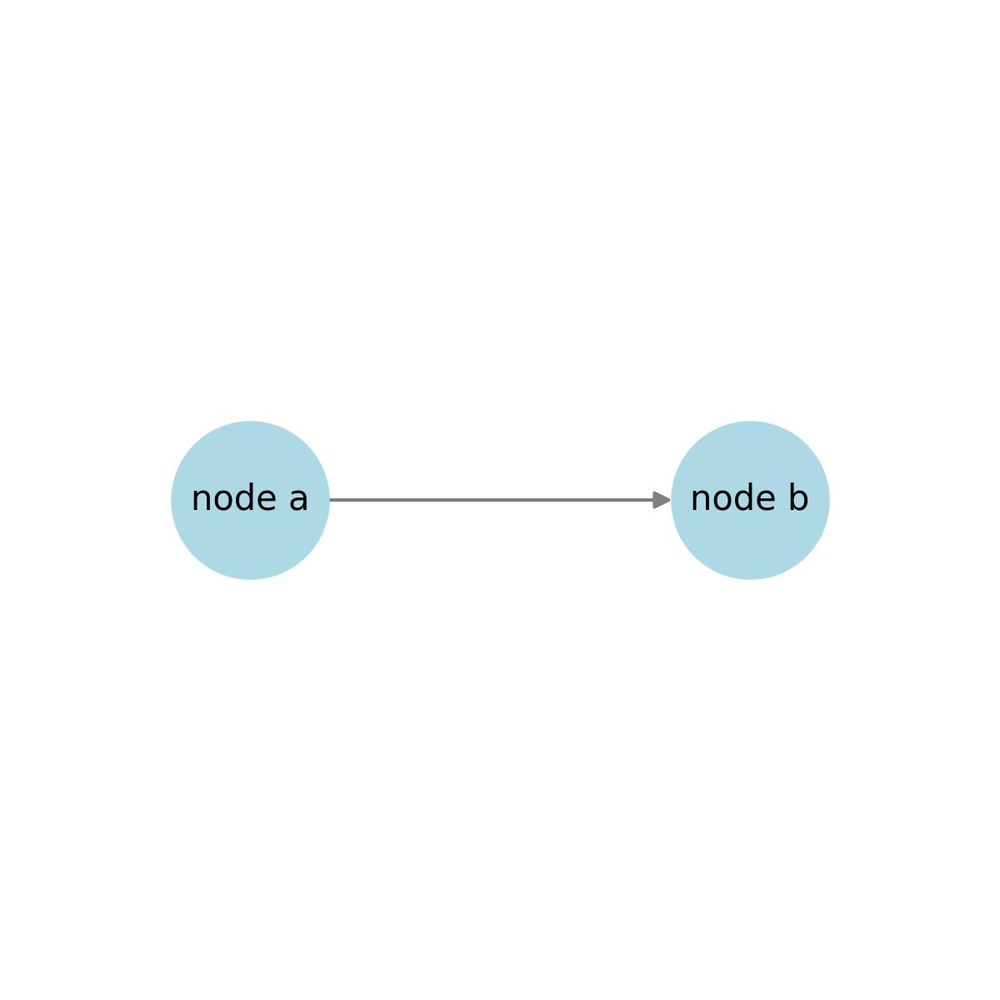
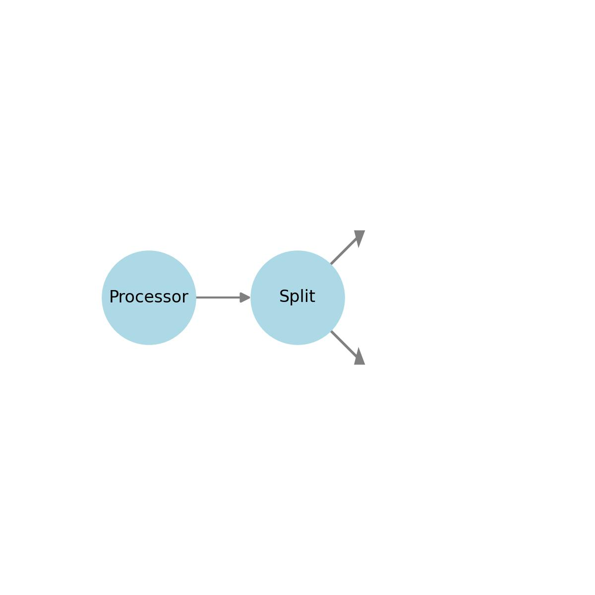
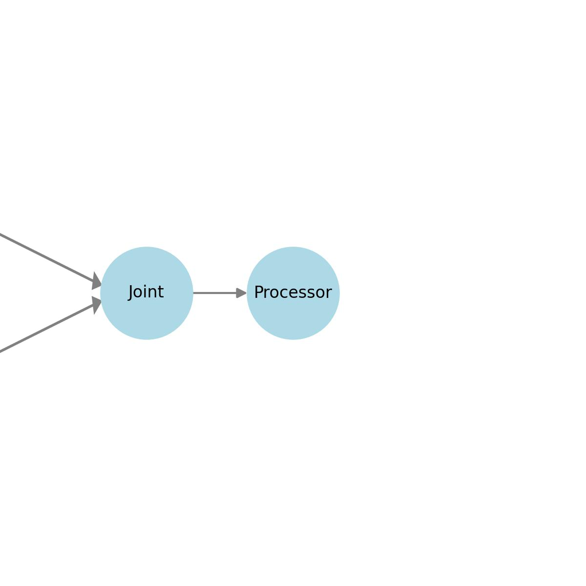

# Discrete event Simulation for Manufacturing
## Overview
FactorySimPy is an opensource, python library for modeling and Discrete-event simulation of systems seen in manufacturing systems. This library has a canonical set of components that are seen in a typical manufacturing setting like processors with processing delay, Joints that pack together  incoming items from different other components, etc. These components' behaviour is pre-built and configurable. User has to provide the model structure and the component parameters to run the simulation model. User can include new features by deriving from the existing classes. This library is built on SimPy 4 and supports as fast as possible and real-time simulation.    
Currently, the library supports discrete flows only and is ideal for systems where the structure remains unchanged. We also plan to add support for material flow.


## Model Description
The system is modeled as a graph composed of two types of components: Nodes and Edges. `Nodes` represent active components, such as processors that introduce delays—for example, machines that pack, unpack, or modify items. `Edges` represent passive entities like conveyor belts, human operators, warehouse robots, or transport vehicles that facilitate the movement of items between nodes. In the simulation model, state changes are driven only by the actions performed by the nodes.

A node maintains two list- `in_edges` and `out_edges`. An edge connects exactly two nodes and serves as an in_edge for the `dest_node` and out_edge for the `src_node`. Graph can have loops(and self loops).
Each Node maintains two lists: in_edges and out_edges. An Edge connects exactly two nodes — it acts as an out_edge for the src_node (source node) and as an in_edge for the dest_node (destination node). Each Edge stores direct references to its source and destination nodes. The graph structure supports both loops and self-loops, and each Edge is exclusively associated with a single connection between a source node and a destination node (which may be the same node in case of a self-loop).


### Example Representation
An example model with 2 nodes and an edge

<!---  --->


---

## Component Design:Important Classes

`Node` and `Edge` serves as the base classes. Inaddition ther is `Item` class that represents the items that flow in the system. `Nodes` are the active elements in the system and are static and `Edge` represents the passive elements in the systems and are used to interconnect two nodes.

`Nodes` are the active, static elements in the system and are responsible for operations such as processing, splitting, or combining items. Each node maintains a list of in_edges and out_edges, which are references to edge objects that connect it to other nodes. Nodes also have parameters such as a unique `name`, `work_capacity` (the maximum number of items that can be processed simultaneously),`delay` (the processing time per item, which can be a constant or a random generator), and `store_capacity` (the number of items that can be held internally). Common node types include Processor, Split, Joint, Source, and Sink.
`Edges` are passive components that connect exactly two nodes: a source_node and a dest_node. Each edge also has a `capacity` and methods like `can_put`, `reserve_put`, `put`, `can_get`, `reserve_get`, and `get` to control item flow. Specific types of edges include Buffer, Conveyor, and Fleet. `Buffers` act as FIFO queues with a defined `delay`. `Conveyors` move items between nodes while preserving order and support both discrete (slotted belts) and continuous motion. Discrete conveyors operate in fixed stages defined by delay_per_slot, while continuous conveyors move items at a fixed speed. Conveyors can be `accumulating`(non-blocking)—allowing multiple items to queue if the output is blocked—or `non-accumulating`(blocking), which only accepts an item at the entry if the exit is free. Conveyors are characterized by parameters such as capacity, occupancy, and state, which can be moving, stalled, or empty.


`Fleets` represent systems like warehouse robots or human operators that transport items between nodes without preserving order. A fleet is characterized by its `size` (number of carriers), `delay` (fixed or variable), and `state` for each carrier, which can be either `moving` or `idle`. These components together define a flexible and modular system for modeling material flow in discrete-event simulation.

 

<!-- Here, is an example of a model with 3 nodes that are connected using 2 edges. Nodes are of type source, machine and sink and edges are of type conveyor.  -->

## System Description

### Rules for interconnection
1. Nodes are static entities like processor, source, sink, split, joints, etc.
2. Edges are directed and connects one node to another. Conveyor, buffer and fleet are the entities that are of type Edge.
3. Items are discrete parts that flow in the system through the directed edges from one node to another. 
3. Each Node has two lists `in_edges` and `out_edges` that points to the references of the edges that comes in and go out of the node
4. Each Edge stores pointers to a `src_node` and a `dest_node`. An Edge can be used only to connect a single node(`src_node`) to another (or same) node(`dest_node`).
5. An Edge can have the same node in both `src_node` and `dest_node`. (ie, a node can be connected to itself)
6. Nodes are the active elements whose activites initiates state changes in the system.
7. Edges are the passive elements and state change occurs due to actions initiated by nodes
8. To split the output from a `processor` node into two streams, a `Split` must be connected to the `processor` using an Edge.
9. To join two streams and to feed as input to a `processor` node, a `Joint` must be connected to the `processor` using an Edge


<!-- 

 -->

### Steps for Connecting Components
1. Instantiate nodes and edges:
   ```python
   n1 = Node()
   n2 = Node()
   n3 = Sink()
   e1 = Edge()
   e2 = Edge()
   ```
2. Establish connections:
   ```python
   e1.connect(n1, n2)
   e2.connect(n2,n3)
   ```

---

## **Class Hierarchy**
```
├── Node(Base Class for components that processes items)
    ├── Processor     # Processes items 
    ├── Joint      # Merges multiple flows into one
    ├── Split       # Splits a flow into multiple branches.
    ├── Sink        # Consumes items
    ├── Source       # generates items
  

├── Edge(Base Class for components that transfer items from one node to another)
    ├── Conveyor   # transfers items in a sequence from a node to another and order is preserved
    ├── Fleet      # Fleet of human operstor, warehouse robots or transport vehicles
    ├── Buffer     # Queue of items waiting to be accepted by the next node in a model

```


## Behavior of Components


---


### **Node** \( N \):
- **Purpose**: Active elements in the system.  
- **Parameters**
     - `name`: unique name of a node
     - `in_edges`: list of input edges to the node
     - `out_edges`: list of output edges of the node
     - `work_capacity`: no. of simultaneous operations that the node can perform
     - `store_capacity`: Capacity of the store.
     - `delay`: Time for processing.

### Derived Classes from Node 
  1. **Source** \( N_src \):
     - **Purpose**: to mark the start of the model
      - **Behavior**: yields `reserve_put` on the connected edge. If yielded, the item is added using `put`. It fills the inbuiltstore with items until the capacity is reached. 
      

  2. **Sink** \( N_snk \):
     - **Purpose**: To mark the end of the model
     - **Behavior**: yields `reserve_get` on the incoming connected edge. If yielded, the item is retrieved using `get`. The retrieved item is put into its inbuiltstore until its store_capacity is reached.

  3. **Processor** \( N_p \):
    - **Purpose**: To modify/process items
    - **Behavior**: yields `reserve_get` on the incoming connected edge. If yielded, the item is retrieved using `get`. The retrieved item is modified and put into its inbuiltstore until its store_capacity is reached. Then these processed items from the inbuiltstore is pushed to the outgoing edge by using `reserve_put` and `put` methods            
    - **Parameters**:
        - `node_type`: Processor.


4. **Split** \( N_sp \):
    - **Purpose**: To multiplex incoming items into two outgoing flows
    - **Behavior**: yields `reserve_get` on the incoming connected edge. If yielded, the item is retrieved using `get`. The retrieved item is either put into out_edge 1 or out_edge 2 based on the rule specified by the user. Then these processed items  is pushed to the respective outgoing edge by using `reserve_put` and `put` methods            
    - **Parameters**:
        - `node_type`: Split
        -  `rule` : percentage of split
              
5. **Joint** \( N_jt \):
           
     - **Purpose**: To combine items from two incoming edges
     - **Behavior**: yields `reserve_get` on the incoming connected edges. If yielded, the items are  retrieved using `get`. The retrieved items are combined and put into inbuiltstore. Then these processed items  is pushed to the respective outgoing edge by using `reserve_put` and `put` methods            
    - **Parameters**:
      - `node_type`: Joint
              
                
### **Edge** \( E \):
- **Purpose**: Connects two nodes.  
- **Parameters**
     - `name`: unique name of a edge
     - `src_node`: reference to the source node
     - `dest_node`: reference to the destination node
     
### Derived Classes from Edge 

  1. **Conveyor** \( E_c \):
     - **Behavior**: Waits for reserve_put and put to add items to the conveyor belt. Moves the items from one end to the other and waits for the item to be picked up from the belt using `reserve_get` and `get` method. It maintains the order of items. 
     - **Parameters**:
        - `belt_capacity`: Capacity of the conveyor.
        - `delay_per_slot`: Time for an item to move from one slot to the next.
        - `accumulating`: Boolean indicating if items can accumulate at the conveyor's end.
        
     - **Methods**:
        - `can_put()`, `reserve_put`, `put()`: Add items.
        - `can_get()`, `reserve_get`, `get()`: Retrieve items.

  2. **Buffer** \( E_b \):
     - **Purpose**: It acts like a FIFO queue with a specified delay.
     - **Behavior**: waits for reserve_put and put of items. Once an item is put inside buffer, it becomes available for the destination node after `delay` amount of time. Destination node can retrieve the items from buffer's store using `reserve_get` and `get` methods.

     - **Parameters**:
        - `store_capacity`: Capacity of the buffer.
        - `delay`: Time after which the item becomes available at the output

       
     - **Methods**:
        - `can_put()`, `reserve_put`, `put()`: Add items.
        - `can_get()`, `reserve_get`, `get()`: Retrieve items.

  3. **Transporter** \( E_t \):
     - **Purpose**: Handles bursty traffic by operating in parallel.
     - **Behavior**: Spawns additional instances as required to manage flow surges.

 

---
 

### **Item** \( I \):
- **Purpose**: Items that flow in the system  
- **Parameters**
     - `item_id`: unique id of an item
     
     

---


